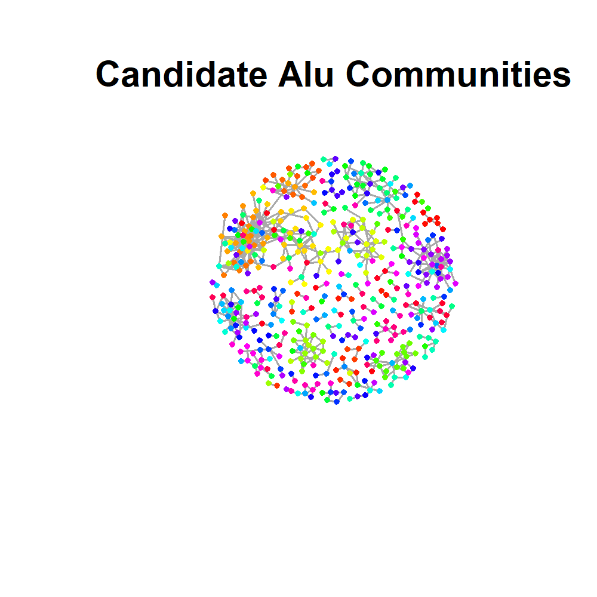

```{r setup, include=FALSE}
knitr::opts_chunk$set(echo = TRUE)
library(knitr)
library(kableExtra)
```

# Introduction

Alu elements are transposable elements (TE) that hijack LINE1 encoded retrotransposition proteins to copy and paste themselves into genomic DNA[@Doucet2015] Discoveries that transposable element polymorphisms in the human population could modulate gene expression[@Wang2017] and active evolutionary pressure toward enhancers paired with long-range interactions with promoters[@Su2014] have challenged earlier conceptions they they were “junk” DNA.[@Pray2008] This year, substantial evidence has been provided suggesting that a complementary sequence motif found in Alu elements of the same family can induce RNA polymerase-II transcribed RNA-RNA interactions in cases where an Alu sequences are embedded in a promoter upstream antisense transcript and another Alu sequence is embedded in an enhancer transcript.[@Liang2023] Based on this mechanism, it has been speculated that mostly disjoint enhancer promoter interaction networks (EPRI) may exist that can be rapidly rewired and have implications in evolutionary and disease contexts[@Wen2023] and that the inherent RNA polymerase-III transcription of Alu elements essential for their retrotransposition could yield similar RNA-RNA based dynamics in non-enhancer/promoter embedded elements. Moreover, it has been demonstrated with FISH that LINE1 and Alu elements both exclusively colocalize with their specific subfamilies in cellular compartments.[@Lu2021] For reasons which will not be discussed in detail in this report, it is hypothesized that understanding the dynamics of these Alu communities could be relevant to one of the group member’s research into neurodegenerative disease mechanisms.

# Problem Description

With a lack of RIC-seq data to pull from to study the phenomenon, but an abundance of collaborators with the ability to provide Pore-C targeted capture data, we propose that a heuristic community detection approach could be useful for identifying candidate loci for target capture. The algorithm we settled on was the Leiden algorithm[@Traag2019] due to specific improvements over the Louvain algorithm[@Blondel2008] which will be discussed in detail in the algorithm description section. Another reason we decided to select the Leiden algorithm is that it is necessarily highly iterative and thus provides a good use case for using Rcpp which was the main course topic of interest for some of the group members who were interested in learning C++, which is important for their subfield. There is also a practical reason for rewriting the algorithm in C++. igraph[@Csardi2006] is written in C and maintained by a large team of computer scientists working in the field of network analysis and it is unrealistic to believe we can even come close to competing with their computational speed within the timeframe of this project. However, in their C-based implementation, it is difficult to add low-level customized features to the algorithm due to inflexibility resulting from a lack of encapsulation and innate challenges with memory management. By rewriting the algorithm in object-oriented C++ , it will be potentially useful to one of the group members who may want to extend the functionality of the algorithm. For example, on-the-fly checking for intact RNA polymerase-III/II binding domains, more complex weighting schemes using local sequence alignment and expected bindable transcript lengths, as well as dynamic storage of relevant properties for (and results of) these calculations within partition, community, and graph objects. Extending the Leiden algorithm with these features is beyond the scope of this class and will be reserved for potential future projects. Instead, the goal of our project was to get the algorithm working in C++ to have a foundation for these future projects. Our second aim was to use our implementation to demonstrate the Leiden algorithm’s viability in identifying candidate chromatin modulating Alu communities with a crude weighting scheme incorporating publicly available Hi-C[@Lee2023], ATAC-seq data[@Corces2020], and the Dfam transposable elements database[@Storer2021].

# Package Features

Our package includes two main user-callable functions. The first, createAluGraph creates our weighted adjacency matrix by using taking the Hadamard product of DNA-fragment contact probabilities from Fit Hi-C callsets, a boolean matrix of whether or not both fragments contain accessible chromatin (peaks) based on the ATAC-seq data, and counts of the expected number of potential simultaneous Alu-mediated RNA-RNA interactions (assuming that the Alu has a functional RNA polymerase III binding and that the Alu’s are far enough apart that there is only one Alu sequence per transcript). It outputs the adjacency matrix as a list of connections which is typically more memory efficient. Several helper functions for creating the input matrices for createAluGraph are included as well. The second primary, user-callable function is runLeiden which is exported from C++. It takes the output of createAluGraph, or any other R list of connections with the items “to”, “from”, and “weights.” The function runLeiden interfaces the Optimizer class with R allowing the algorithm to be called as an R function. The Optimizer class contains utilities for running each step of the Leiden algorithm as defined by the original paper[@Traag2019]. The Partition class contains utilities for creating and modifying partitions. The Community class contains utilities for creating and modifying communities, and the Graph class contains utilities for creating and modifying nodes and edges in a graph. Lastly, the package contains a function plotLeiden to plot the results of our algorithm which requires graph.data.frame from igraph.[@Csardi2006] 

# Algorithm Description

## Leiden Algorithm

Modularity 

$$
H = \sum_{c} \left[ e_c - \gamma \left( \frac{n_c}{2} \right) \right]
$$

Where:

## Weight Calculation 

Need other equation from the slide to explain the hadamard product better with the sums and stuff

$$
M = A \odot B \odot C
$$

Where:

# Evaluation

To evaluate our implementation of the Leiden algorithm, we compare it to the gold-standard of network analysis software igraph[@Csardi2006] using several toy models including “noperfectmatching” and “Zachary.” For the more complex toy model, Zachary, we try several random seeds to account for randomness and show that the models are generating overlapping sets of models. We also test each function on several increasing resolution hyperparameters to demonstrate the expected behavior that the number of communities increases until eventually, the resolution is too high to identify any communities. To evaluate efficiency, we used microbenchmark[@Mersmann2023] to show, as expected, that the igraph implementation is orders of magnitude faster than our implementation, and scales better going from a 16 node graph “noperfectmatching” to the 32 node graph “Zachary.” Suggesting that our implementation should be optimized further before we start adding the planned features. 

```{r, echo=FALSE}
table1 <- data.frame(
  c("Ours", "igraph"),
  c("Data1", "Data2"),
  c("Data1", "Data2")
)

colnames(table1) <- c("Implementation",
                      "16-Node Graph\nAverage Time [microseconds]",
                      "32-Node Graph\nAverage Time [microseconds]")
  
knitr::kable(
  table1,
  caption="Table 1: Benchmarking Results comparing our implementation speed to igraph", format="html", align=c('c', 'c', 'c')
) %>% kable_styling(
  full_width = F,      # This line is for applying default Bootstrap theme
  bootstrap_options = c("striped", "hover", "condensed", "responsive")
) %>% row_spec(
  0,
  bold = T,
  color = "white",
  background = "gray"
)
```

To see if our weighting scheme with the Leiden implementation provides sensible results on our biological data and runs in a reasonable amount of time to be useful on the scale of data it was designed for, we create weights from chromosome 21 using createAluGraph and our runLeiden implementation. As expected, our plot shows that AluJ’s are not likely to be as involved in chromatin remodeling via RNA-RNA interactions. This is sensible because AluJ’s are very old and not likely to be transcribed and/or not likely to be as complementary to each other due to accumulated mutations. Producing these communities took PUT TIME HERE suggesting that while the implementation should be optimized, it is not unacceptably slow as a discovery tool. A plot of these communities is shown in Figure 1. 

```{r, echo=FALSE}

```

All relevant code to run the benchmarking and generate the above plot can be found in the supplementary notebook.


# Supplemental

This section will walk through installing our package and replicating the results 
of our benchmarking. First set your working directory

```{r, results='hide', message=FALSE, warning=FALSE}
# change this!
setwd("C:/Users/bbessell/OneDrive - Michigan Medicine/Documents/Courses/BIOSTAT615/test_package")
#setwd("C:/Users/bbessell/Projects/GitHub/AluNet")
```

To run our package, first install it and some other dependencies we will use to benchmark

```{r, results='hide', message=FALSE, warning=FALSE}
if (!require("igraph")) {
  install.packages("igraph")
}
if (!require("microbenchmark")) {
  install.packages("microbenchmark")
}

if (!require("devtools")) {
  install.packages("devtools")
}

devtools::install_github("babessell1/AluNet/AluNet")

# the above doesn't work
#url <- "https://github.com/babessell1/AluNet/raw/main/AluNet_1.0.tar.gz"
#download.file(url, "AluNet_1.0.tar.gz")
#install.packages("AluNet_1.0.tar.gz",repo=NULL)

```

Then we will load it, igraph, and microbenchmark to benchmark against the current gold standard of clustering algorithm implementations.

```{r, results='hide', message=FALSE, warning=FALSE}
library(igraph)
library(microbenchmark)
library(AluNet)
```

First, we check against several toy models. Note that the RNG is different for each implementation of Leiden so we will run several different seeds for each one to show that they are functioning similarly.

To do this we define a function to to run igraph's Leiden algorithm and plot the output, we define it here since it is not part of our package. 

```{r}
runIgraph <- function(gdf, iterations, gamma, theta) {

  ldc <- cluster_leiden(
    gdf,
    resolution_parameter=gamma,
    objective_function="CPM",
    weights=g_list[["weight"]],
    beta=theta,
    n_iterations=iterations,
    vertex_weights = rep(1, length(unique(c(g_list[["to"]], g_list[["from"]]))))
  )
  return(ldc)
}

plotIgraph <- function(gdf, ldc) {
  color_palette <- heat.colors(100)
  
    # create colormap for the communities
    get_community_colors <- function(num_communities) {
    rainbow(num_communities)
    }
  
    # map communities to the colormap
    num_communities <- length(unique(ldc$membership))
    community_colors <- get_community_colors(num_communities)
    colors <- community_colors[as.factor(ldc$membership)]
  
  plot(
    gdf,
    layout = layout_with_fr(gdf),
    vertex.color = colors,  # Color nodes based on community
    #edge.color = color_palette[g_list$weight],  # Map edge color from cold to hot
    vertex.label = V(gdf)$community,
    edge.arrow.size = 0,  # Set arrow size to 0 to remove arrows
    main = "iGraph's C-based clustering"
  )
  
  # Add a legend for community colors
  legend("topright", legend=unique(ldc$membership),
         col = community_colors, pch = 19,
         title = "Communities", cex = 0.8)
}
```

Our first toy model is "noperfectmatching" which has very well defined communities except for the central node which can belong to any of them depending on the starting conditions. This is a simple model and thus should converge in only a single iteration, despite us setting a maximum of 10.

We define our resolution parameter, gamma as .1 which should be small enough to identify more granular communities that will make it easier to compare its accuracy to igraph, we set theta to 0.01 because it is the middle of the recommended ranges of theta by the authors of the Leiden algorithm which should result in a moderate degree of randomness in the refine step. Since the toy models come from the igraph package, we also have to convert them into a format interpretable by our function, which is a list of connections "to" "from" and "weight."

```{r}
toy = "noperfectmatching"
iterations <- 10
gamma <- .1  # gamma > 0
theta <- 0.01 # good theta is 0.005 < 0.05

g <- as_edgelist(make_graph(toy))
g_list <- list(
  to=g[,1],from=g[,2],
  weight=rep(1, length(g[,1]))  # all 1
  
)
```

```{r}
seed <- 1
result <- runLeiden(g_list, iterations, gamma, theta, seed)
plotLeiden(result)
```


```{r}
gdf <- make_graph(toy)
set.seed(1)
igraph_result <- runIgraph(gdf, iterations, gamma, theta)
plotIgraph(gdf, igraph_result)
```

Next we benchmark the model to show that igraph, which is developed and maintained by a very large team of computer scientists, is much more optimized than our implementation.

```{r, results='hide', message=FALSE, warning=FALSE}
rm(.Random.seed)
# Use microbenchmark to time the function
mb_ours <- microbenchmark(
  runLeiden(g_list, 1, gamma, theta),
  times=10
)

mb_igraph <- microbenchmark(
  runIgraph(gdf, 1, gamma, theta),
  times=10
)
```

```{r}
# Print the result
print(rbind(mb_ours, mb_igraph))
```

Next we try with a larger more complex toy models to also show that igraph's implementation scales better than ours (4:1) compared to (5:1) for a graph that is twice as big. 

```{r, results='hide', message=FALSE, warning=FALSE}
toy = "Zachary"
g <- as_edgelist(make_graph(toy))
g_list <- list(
  to=g[,1],from=g[,2],
  weight=rep(1, length(g[,1]))  # all 1
  
)
gdf <- make_graph(toy)


rm(.Random.seed)
# Use microbenchmark to time the function
mb_ours <- microbenchmark(
  runLeiden(g_list, 3, gamma, theta),
  times=10
)

mb_igraph <- microbenchmark(
  runIgraph(gdf, 3, gamma, theta),
  times=10
)
```

```{r}
print(rbind(mb_ours, mb_igraph))
```

Now, let's increase the iteration number to 10 so that the partition can converge, and try several random seeds to see if the sets of partitions  produced by each method overlap.

```{r}
iterations <- 10
gamma <- .1  # gamma > 0
theta <- 0.01 # good theta is 0.005 < 0.05

g <- as_edgelist(make_graph(toy))
g_list <- list(
  to=g[,1],from=g[,2],
  weight=rep(1, length(g[,1]))  # all 1
  
)
gdf <- make_graph(toy)
```

```{r}
seed <- 1
result <- runLeiden(g_list, iterations, gamma, theta, seed)
plotLeiden(result)
```

```{r}
gdf <- make_graph(toy)
set.seed(1)
igraph_result <- runIgraph(gdf, iterations, gamma, theta)
plotIgraph(gdf, igraph_result)
```

Notice these models are slightly different, Since this graph is a bit more  complicated, and prone to RNG-based variation, which cannot be equalized by setting the same seed due to differences in implementation, we can rerun the igraph implementation with 2 as our seed instead of 1, to get the same partition.

```{r}
gdf <- make_graph(toy)
set.seed(2)
igraph_result <- runIgraph(gdf, iterations, gamma, theta)
plotIgraph(gdf, igraph_result)
```

Let's see if we consistently produce similar community configurations.

```{r}
seed <- 3
result <- runLeiden(g_list, iterations, gamma, theta, seed)
plotLeiden(result)
```

```{r}
gdf <- make_graph(toy)
set.seed(3)
igraph_result <- runIgraph(gdf, iterations, gamma, theta)
plotIgraph(gdf, igraph_result)
```

```{r}
seed <- 4
result <- runLeiden(g_list, iterations, gamma, theta, seed)
plotLeiden(result)
```

```{r}
gdf <- make_graph(toy)
set.seed(4)
igraph_result <- runIgraph(gdf, iterations, gamma, theta)
plotIgraph(gdf, igraph_result)
```


```{r}
seed <- 5
result <- runLeiden(g_list, iterations, gamma, theta, seed)
plotLeiden(result)
```

```{r}
gdf <- make_graph(toy)
set.seed(5)
igraph_result <- runIgraph(gdf, iterations, gamma, theta)
plotIgraph(gdf, igraph_result)
```

Increasing the resolution parameter, gamma, should decrease the size of the  communities, let's see if that happens.

```{r}
gamma <- 0.5
```

```{r}
seed <- 1
result <- runLeiden(g_list, iterations, gamma, theta, seed)
plotLeiden(result)
```

```{r}
gdf <- make_graph(toy)
set.seed(1)
igraph_result <- runIgraph(gdf, iterations, gamma, theta)
plotIgraph(gdf, igraph_result)
```

Let's create a temporary directory and make sure we have a few more dependencies to download and process some data as well as plot our results

```{r}
if (!require("R.utils")) {
  install.packages("R.utils")
}
library("R.utils")


dir.create("temp")
```

To show its utility on biological data, we first download some Fit-Hi-C data[@Lee2023]

```{r, eval=FALSE}
path_ <- paste0(getwd(), temp)
setwd(path_)
file_name <- "hic_data.txt.gz"
url <- "https://www.ncbi.nlm.nih.gov/geo/download/?acc=GSE148434&format=file&file=GSE148434%5FNS%5Fall%2E5kb%2E1e%2D2%2EFitHiC%2Eall%2Etxt%2Egz"

download.file(url, paste(path_, file_name, sep = "/"), mode = "wb")
gunzip(file_name, remove=TRUE)
```

Then we download Dfam mobile elements[@Storer2021] (be careful, it is very large). We place it in a folder in the current working directory.

```{r. eval=FALSE}
url <- "https://www.dfam.org/releases/Dfam_3.8/annotations/hg38/hg38.hits.gz"
file_name <- "hg38.hits.gz"
hg38_file <- paste(path_, file_name, sep = "/")
download.file(url, hg38_file, mode = "wb")
gunzip(hg38_file, remove=FALSE)
```

Then we download some example ATAC-seq data.[@Corces2020]

```{r}

```

Then we run several helper functions to convert each of the data into dataframe (matrix)

```{r}

```

Then we run our function to convert these data into our weighted adjacency matrix

```{r}

```

Then we use these weights as inputs for our implementatoin of the Leiden Algorithm

```{r}

```
If you don't want to download large data, you can download our processed data instead to run our implementation of the Leiden algorithm on it.

```{r}
url <- "https://github.com/babessell1/AluNet/raw/main/edges_data_frame.csv"
download.file(url, "edges_data_frame.csv")
dataframe <- read.csv("edges_data_frame.csv")
list <- as.list(dataframe)
```
Then we run the Leiden algorithm.

```{r}
result <- runLeiden(list, 1, 1, 0.01, 1)
```
Plot the results and save as a high-dpi png.

```{r}
png("alu_plot.png", width = 1000, height = 1000, res = 300)
plotLeiden(result)
dev.off()
```

# References
